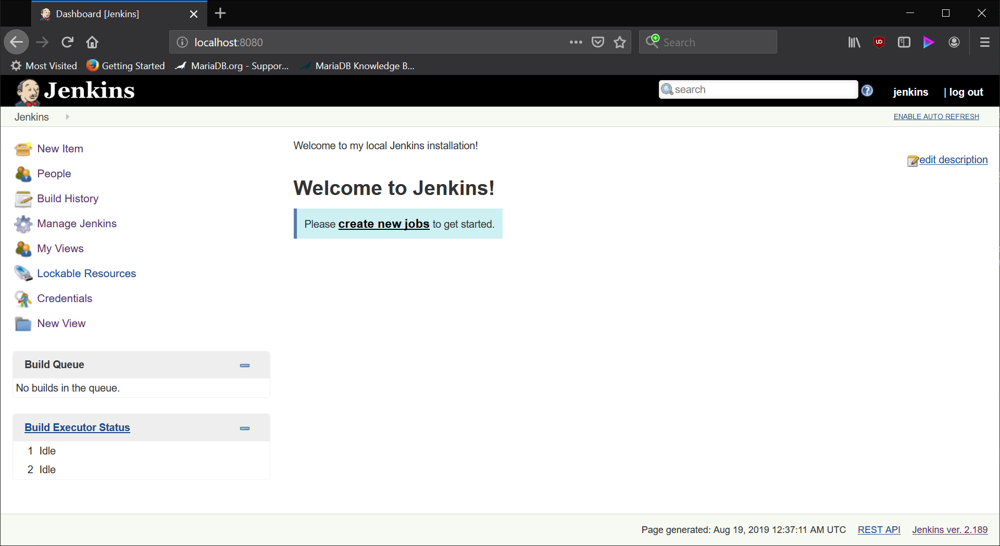
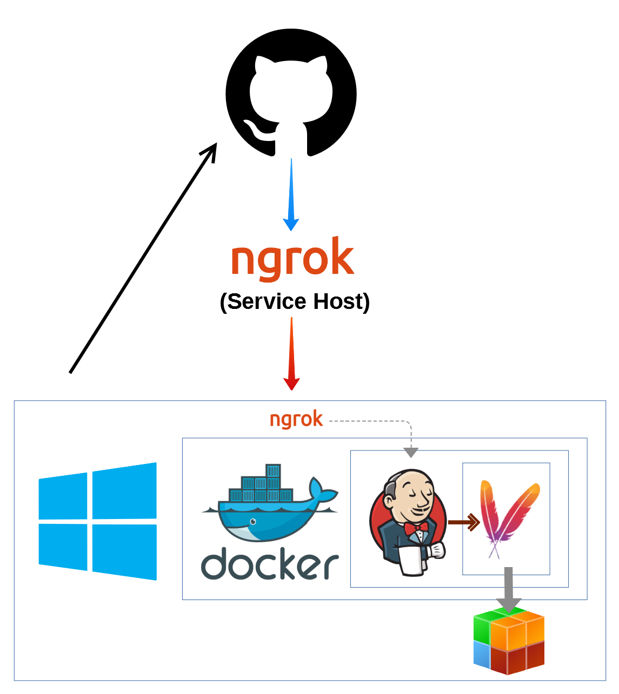

# `jenkins-tutorial` <!-- omit in toc -->

# Table of Contents <!-- omit in toc -->
- [Introduction](#introduction)
  - [Setup](#setup)
    - [Docker](#docker)
    - [Jenkins for Docker](#jenkins-for-docker)
    - [Jenkins Bind Mount](#jenkins-bind-mount)
    - [Final Tweaks](#final-tweaks)
    - [Review](#review)
    - [Accessing the Container](#accessing-the-container)
- [Logging In](#logging-in)
- [Architecture](#architecture)
  - [Tools Used](#tools-used)
    - [Jenkins](#jenkins)
    - [Maven](#maven)
    - [Git and GitHub](#git-and-github)
    - [ngrok](#ngrok)

# Introduction

This repository will be a testing ground for installing, configuring, and learning how to integrate Jenkins into an everyday build pipeline. 

## Setup

### Docker
I've installed Docker Desktop (for Windows) to fully leverage a containerized development experience. 

### Jenkins for Docker
I am currently using the Docker image for [jenkins/jenkins:latest](https://hub.docker.com/r/jenkins/jenkins). The official repository is now considered deprecated, with the community maintaining for LTS and future releases.

To pull the latest image in your Docker environment, you can use the following:

`docker pull jenkins/jenkins`

### Jenkins Bind Mount

I have created a folder on my host machine to maintain the Jenkins installation across container life shutdowns and restarts. The lets me keep the data external to the container process, and then mount into it as needed. This allows me to seamlessly map data on my machine into a Docker container. 

To replicate, you should determine a folder on your host machine and designate it as the source. Then when creating the container: 

`docker run -d -u 1000 -v {JENKINS_HOME}:/var/jenkins_home -p 8080:8080 -p 50000:50000 jenkins/jenkins:latest`

In my case, I ran the following: 

`docker run -d -u 1000 -v "D:\var\jenkins_home":/var/jenkins_home -p 8080:8080 -p 50000:50000 jenkins/jenkins:latest`

> Note: Because I am using Docker for Windows, I need to wrap some of the paths as original Windows paths. Also, due to permissions issues I have to pass the user ID 1000 in the run command, as the default jenkins user is ID 1000. I decided to use a bind mount to choose an explicit path based on my local storage. Otherwise, I could have let Docker create a volume and manage it. 

### Final Tweaks

For the ease of referring to the container, I stopped and renamed it to `my_jenkins`: 

`docker rename {randomly_generated} my_jenkins`

Finally, to make sure that `my_jenkins` starts and stays running when my Docker Desktop loads, I modified the restart policy: 

`docker update --restart always my_jenkins`

A restart policy of [always](https://docs.docker.com/config/containers/start-containers-automatically/) will ensure that the container is restarted except when manually stopped. This means that when my Docker daemon restarts (or boots for the first time), the jenkins service should start up automatically. 

All of this information and more can be found at the official [Jenkins for Docker](https://github.com/jenkinsci/docker/blob/master/README.md) documentation. 

### Review

If we review and inspect the container, we should see that it is running: 

```
$ docker container ls
CONTAINER ID        IMAGE                    COMMAND                  CREATED             STATUS              PORTS                                              NAMES
3f810d1988ac        jenkins/jenkins:latest   "/sbin/tini -- /usr/…"   22 hours ago        Up 20 hours         0.0.0.0:8080->8080/tcp, 0.0.0.0:50000->50000/tcp   my_jenkins
```

And has the appropriate parameters for bind mount and restart policy:

```
"Mounts": [
    {
        "Type": "bind",
        "Source": "/host_mnt/d/var/jenkins_home",
        "Destination": "/var/jenkins_home",
        "Mode": "",
        "RW": true,
        "Propagation": "rprivate"
    }
],

---

"RestartPolicy": {
    "Name": "always",
    "MaximumRetryCount": 0
},
```

### Accessing the Container

If we ever need to hop into the container's linux environment, we can do so with bash: 

`$ winpty docker exec -it my_jenkins bin/bash`

> Note: `winpty` is a necessary wrapper because I am using GitBash for Windows

# Logging In

The Docker container will expose Jenkins over port 8080 on your localhost based on the default configurations. For the purposes of learning Jenkins, I'm left this as default. The first time you access localhost 8080 you'll be prompted to login with the admin password and then configure plugins/add another admin user.

I've already made it through these steps, using the very creative **jenkins** username.

Now, if I navigate to [http://localhost:8080/](127.0.0.1:8080) from my web browser, I see the login page:


Let's go ahead and login with our <span title="it's definitely not **jenkins**">**super secret password**</span>.


Since we're learning Jenkins and haven't created any projects so far, we should see a relatively blank dashboard: 



Great! We're all set and ready to start developing with Jenkins. Progress of this project will be maintained in the [Wiki](https://github.com/tylervanover/jenkins-tutorial/wiki) accompanying this repository. 

# Architecture

As the project space grows, I'll document the tools and workflows that I'm currently integrating into CI/CD loop. This diagram will be updated regularly to reflect changes. 

The current project architecture is as follows: 



## Tools Used

### Jenkins
Jenkins is the current automation server for our CI/CD loop.

#### Platform

I'm currently running Jenkins on Docker Desktop for Windows via the `jenkins/jenkins:lts` image from Docker Hub. It runs locally and exposes an endpoint on port 8080

#### Responsibilities

* Receives automation events (webhooks) from SCM (GitHub)
* Executes build phases from Maven projects based on project **pom.xml**
* Tracks the artifacts generated from Maven projects based on project **pom.xml**

### Maven

Maven is the primary build automation tool for our projects. We'll create Java Maven projects and configure different phases of the build to take place. 

#### Platform

Maven is installed directly in our Jenkins Docker container, and configured from the Jenkins dashboard. 

#### Responsibilities

* Receives commands from Jenkins that correspond to project life cycle events
  * `mvn clean package` is the preferred life cycle for our simple Java projects
* Executes the build phases and goals from the project **pom.xml** based on the inputs received from Jenkins
* Generates the artifacts and build states of the project

### Git and GitHub

Git using GitHub is our Source Code Management (SCM) system. 

#### Platform

Standard GitHub repositories. 

#### Responsibilities

* Maintains the code base for projects
* Fires automation events for items like a change in the source (PUSH)
* Delivers webhook payloads to Jenkins box so build can take place

### ngrok

Because we run Jenkins locally, `ngrok` is our Reverse Proxy marshalling agent. 

#### Platform

Free-tier service that monitors and connects two endpoints. 

#### Responsibilities

* Opens a tunnel between local endpoint (Jenkins on localhost:8080) and the greater internet
* Monitors events such as POST, GET, and more

