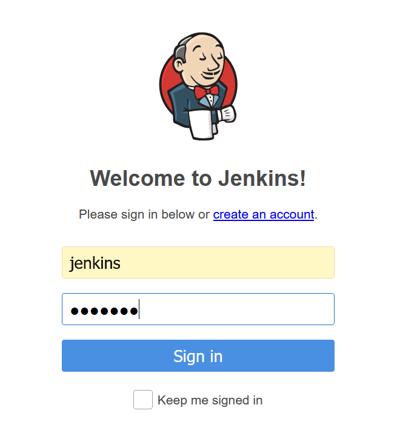
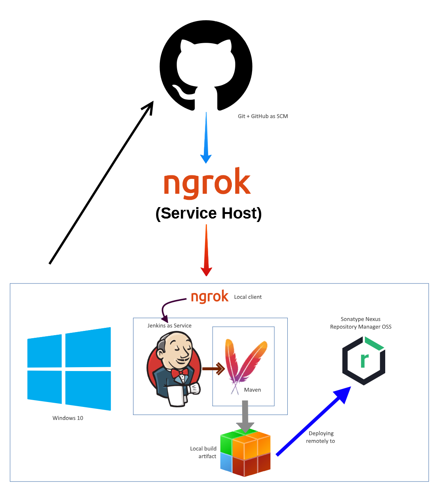

# `jenkins-tutorial` <!-- omit in toc -->

# Table of Contents <!-- omit in toc -->
- [Introduction](#introduction)
  - [Setup](#setup)
    - [Docker](#docker)
    - [Jenkins](#jenkins)
- [Logging In](#logging-in)
- [Architecture](#architecture)
  - [Tools Used](#tools-used)
    - [Jenkins](#jenkins-1)
    - [Maven](#maven)
    - [Git and GitHub](#git-and-github)
    - [ngrok](#ngrok)

# Introduction

This repository will be a testing ground for installing, configuring, and learning how to integrate Jenkins into an everyday build pipeline. 

## Setup

### Docker
I've installed Docker Desktop (for Windows) to fully leverage a containerized development experience down the road. 

### Jenkins

At this time I have switched to using Jenkins as a Windows Service due to some issues I was encountering with Jenkins in Docker, Maven, and the Nexus integration

# Logging In

Jenkins will run on port 8080 on your localhost based on the default configurations. For the purposes of learning Jenkins, I'm left this as default. The first time you access localhost 8080 you'll be prompted to login with the admin password and then configure plugins/add another admin user.

I've already made it through these steps, using the very creative **jenkins** username.

Now, if I navigate to [http://localhost:8080/](127.0.0.1:8080) from my web browser, I see the login page:

Let's go ahead and login with our **super secret password**.

Since we're learning Jenkins and haven't created any projects so far, we should see a relatively blank dashboard: 

Great! We're all set and ready to start developing with Jenkins. Progress of this project will be maintained in the [Wiki](https://github.com/tylervanover/jenkins-tutorial/wiki) accompanying this repository. 

# Architecture

As the project space grows, I'll document the tools and workflows that I'm currently integrating into CI/CD loop. This diagram will be updated regularly to reflect changes. 

The current project architecture is as follows: 

## Tools Used

### Jenkins
Jenkins is the current automation server for our CI/CD loop.

#### Platform

I'm currently running Jenkins on Windows as a Windows service. It runs locally and exposes an endpoint on port 8080

#### Responsibilities

* Receives automation events (webhooks) from SCM (GitHub)
* Executes build phases from Maven projects based on project **pom.xml**
* Tracks the artifacts generated from Maven projects based on project **pom.xml**

### Maven

Maven is the primary build automation tool for our projects. We'll create Java Maven projects and configure different phases of the build to take place. 

#### Platform

Maven is installed directly in our Jenkins box, and configured from the Jenkins dashboard. 

#### Responsibilities

* Receives commands from Jenkins that correspond to project life cycle events
  * `mvn clean package` is the preferred life cycle for our simple Java projects
* Executes the build phases and goals from the project **pom.xml** based on the inputs received from Jenkins
* Generates the artifacts and build states of the project

### Git and GitHub

Git using GitHub is our Source Code Management (SCM) system. 

#### Platform

Standard GitHub repositories. 

#### Responsibilities

* Maintains the code base for projects
* Fires automation events for items like a change in the source (PUSH)
* Delivers webhook payloads to Jenkins box so build can take place

### ngrok

Because we run Jenkins locally, `ngrok` is our Reverse Proxy marshalling agent. 

#### Platform

Free-tier service that monitors and connects two endpoints. 

#### Responsibilities

* Opens a tunnel between local endpoint (Jenkins on localhost:8080) and the greater internet
* Monitors events such as POST, GET, and more

